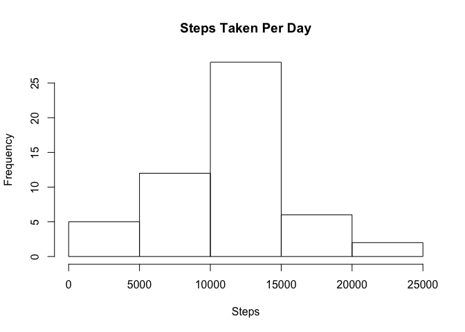
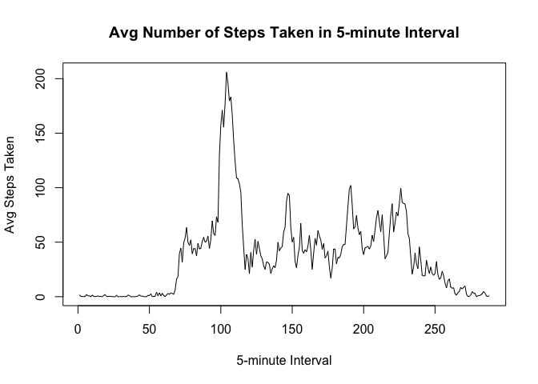
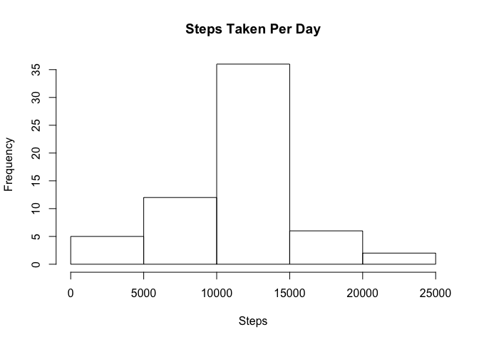

## Loading and preprocessing the data

```r
df <- read.csv("activity.csv")
```


## What is mean total number of steps taken per day?

```r
# 1. Total number of steps taken per day
steps_by_date <- aggregate(steps ~ date, data = df, sum, na.rm = T)

# 2. Make a histogram of the total number of steps taken each day
hist(steps_by_date$steps, main="Steps Taken Per Day", xlab="Steps")
```

<!-- -->

```r
# 3. Calculate and report the mean and median of the total number of steps taken per day
mean_steps <- mean(steps_by_date$steps)
median_steps <- median(steps_by_date$steps)
```
Mean of the total number of steps taken per day: 10766.19  
Median of the total number of steps taken per day: 10765  

Note that on certain days steps are all NAs and by using aggregate as above those dates are not included. If using a different method, it may report 0 steps for those dates which would make the histogram look different.


## What is the average daily activity pattern?

```r
# 1. Make a time series plot (i.e. type = "l") of the 5-minute interval (x-axis) and the average number of steps taken, averaged across all days (y-axis)
interval_avg <- tapply(df$steps, df$interval, mean, na.rm = TRUE)
plot(interval_avg, type="l", main="Avg Number of Steps Taken in 5-minute Interval", xlab="5-minute Interval", ylab="Avg Steps Taken")
```

<!-- -->

```r
# 2. Which 5-minute interval, on average across all the days in the dataset, contains the maximum number of steps?
interval_name <- names(which.max(interval_avg))
```
Interval 835 on average across all the days in the dataset contains the maximum number of steps.


## Imputing missing values

```r
# 1. Calculate and report the total number of missing values in the dataset (i.e. the total number of rows with NAs)
total_nas <- sum(is.na(df$steps))
print(paste("Total number of missing values in the dataset: ", total_nas))
```

```
## [1] "Total number of missing values in the dataset:  2304"
```

```r
# 2. Devise a strategy for filling in all of the missing values in the dataset. The strategy does not need to be sophisticated. For example, you could use the mean/median for that day, or the mean for that 5-minute interval, etc.
na_pos <- which(is.na(df$steps)) # index of the NAs
filled_steps <- interval_avg[as.character(df[na_pos, "interval"])]
print("Replacing NA values with mean of that 5-minute interval.")
```

```
## [1] "Replacing NA values with mean of that 5-minute interval."
```

```r
# 3. Create a new dataset that is equal to the original dataset but with the missing data filled in.
new_df <- df # new_df is the new dataframe.
new_df[na_pos,"steps"] <- filled_steps # Replace NA in new_df with interval average.
head(new_df)
```

```
##       steps       date interval
## 1 1.7169811 2012-10-01        0
## 2 0.3396226 2012-10-01        5
## 3 0.1320755 2012-10-01       10
## 4 0.1509434 2012-10-01       15
## 5 0.0754717 2012-10-01       20
## 6 2.0943396 2012-10-01       25
```

```r
print("New dataset with missing data filled.")
```

```
## [1] "New dataset with missing data filled."
```

```r
# 4. Make a histogram of the total number of steps taken each day and Calculate and report the mean and median total number of steps taken per day. Do these values differ from the estimates from the first part of the assignment? What is the impact of imputing missing data on the estimates of the total daily number of steps?
new_steps_by_date <- aggregate(steps ~ date, data = new_df, sum, na.rm = T)
hist(new_steps_by_date$steps, main="Steps Taken Per Day", xlab="Steps")
```

<!-- -->

```r
new_mean_steps <- mean(new_steps_by_date$steps)
new_median_steps <- median(new_steps_by_date$steps)
```
Mean of the total number of steps taken per day with missing value filled: 10766.19  
Median of the total number of steps taken per day with missing value filled: 10766.19  
After filling in missing values, MEAN remains the same but MEDIAN has changed.
There appears to be minimal impact of imputing missing data.


## Are there differences in activity patterns between weekdays and weekends?

```r
# 1. Create a new factor variable in the dataset with two levels – “weekday” and “weekend” indicating whether a given date is a weekday or weekend day.
library(lubridate)
```

```
## 
## Attaching package: 'lubridate'
```

```
## The following object is masked from 'package:base':
## 
##     date
```

```r
is_weekend <- wday(as.Date(as.character(new_df$date))) %in% c(1,7) # index for weekends
new_df[is_weekend,"day_level"] <- "weekend"
new_df[!is_weekend,"day_level"] <- "weekday"
new_df$day_level <- factor(new_df$day_level)
str(new_df)
```

```
## 'data.frame':	17568 obs. of  4 variables:
##  $ steps    : num  1.717 0.3396 0.1321 0.1509 0.0755 ...
##  $ date     : Factor w/ 61 levels "2012-10-01","2012-10-02",..: 1 1 1 1 1 1 1 1 1 1 ...
##  $ interval : int  0 5 10 15 20 25 30 35 40 45 ...
##  $ day_level: Factor w/ 2 levels "weekday","weekend": 1 1 1 1 1 1 1 1 1 1 ...
```

```r
head(new_df)
```

```
##       steps       date interval day_level
## 1 1.7169811 2012-10-01        0   weekday
## 2 0.3396226 2012-10-01        5   weekday
## 3 0.1320755 2012-10-01       10   weekday
## 4 0.1509434 2012-10-01       15   weekday
## 5 0.0754717 2012-10-01       20   weekday
## 6 2.0943396 2012-10-01       25   weekday
```

```r
# 2. Make a panel plot containing a time series plot (i.e. type = "l") of the 5-minute interval (x-axis) and the average number of steps taken, averaged across all weekday days or weekend days (y-axis).
library(lattice)
steps_by_day_level <- aggregate(steps ~ interval + day_level, data = new_df, mean)
xyplot(steps ~ interval | day_level, steps_by_day_level, type = "l", layout = c(1, 2), xlab = "Interval", ylab = "Number of steps")
```

<!-- -->
